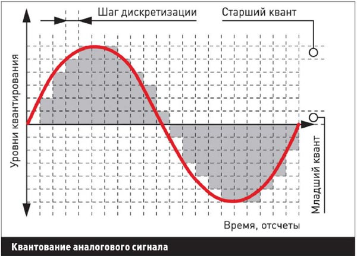
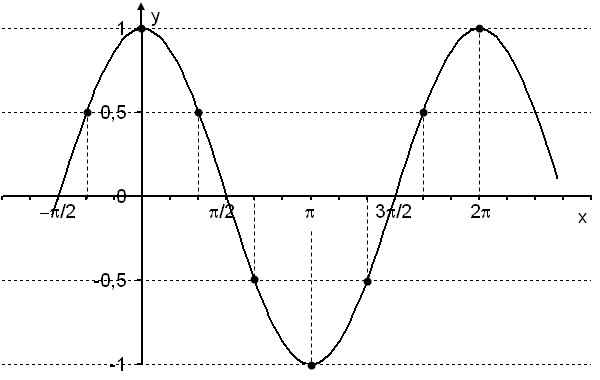
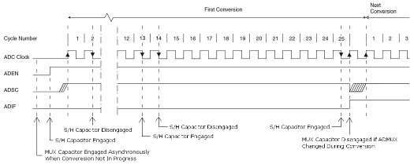
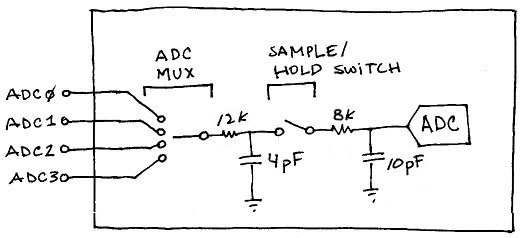
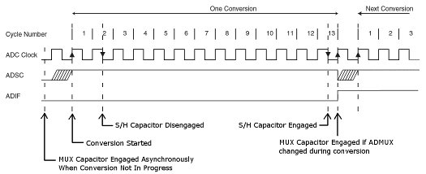
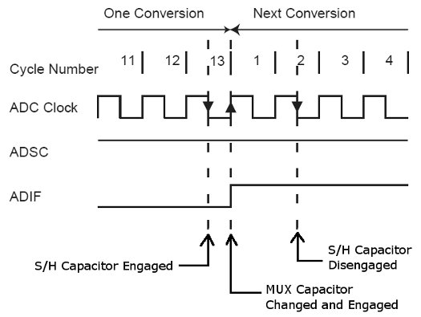

# Аппаратная часть

## Блок АЦП

### Определение количества каналов АЦП
Блок АЦП должен снимать показания со следующих датчиков:
* Датчик тока розетки №1
* Датчик тока розетки №2
* Датчик напряжения
* Другие датчики
Итого блок АЦП должен иметь не менее 4-х каналов.

### Требования к быстродействию АЦП

#### Параметры переменного тока, измеряемые АЦП
SmartSocket обладает функцией оценки качества тока в электрической сети.

Для полной оценки качества переменного тока нужно выполнить все измерения, изложенные
в ГОСТ 32144-2013. Однако, устройство, выполняющее измерения, описанные в стандарте,
является отдельным полноценным проектом.

Для определения потребляемой мощности приборами, подключенными к SmartSocket, нам необходимо
определить следующие параметры сетевого питания:
1) Частоту
2) Напряжение
3) Силу тока

Частота переменного тока в России жестко стандартизована и строго соблюдается
энергетическими компаниями. Соблюдение частоты жизненно необходимо для синхронизации
единой энергетической сети России. ГОСТ гласит:
```
отклонение частоты в синхронизированных системах электроснабжения не должно превышать
+/- 0,2 Гц в течение 95% времени интервала в одну неделю и +/- 0,4 Гц в течение
100% времени интервала в одну неделю
```
Поэтому примем частоту электрической сети равной 50 Гц и в этом проекте не будем её
измерять.

Измерение амплитуды напряжения актуально для России, так как РФ находится в процессе
перехода c 220В на 230В стандарт напряжения, согласно ГОСТ 29322-92. И не ясно в каком
регионе России уже перешли на 230В, а в каком все еще остаются на 220В.

**Итак, в этом проекте мы ограничимся измерением амплитуды сетевого напряжения и тока.**

#### Точность измерений

**Зададим точность измерения амплитуды переменного тока/напряжения 1.6%.**

#### Определение частоты дискретизации АЦП
Так как измерения мы проводим с помощью цифровой техники, то нам нужно преобразовать
непрерывную функцию значений датчика в цифровой вид. Для этого используется дискретизация
сигнала. Мы будем использовать равномерную дискретизацию.



На точность измерения сигнала влияет не только дискретизация сигнала, но и его квантование.
Квантование задается битностью АЦП.

**Примем, что наш АЦП может оцифровывать сигнал с квантованием не хуже 10 бит**

10 бит - это размах сигнала, равный 1024 единицам измерения. Очевидно, что погрешность
измерения равна 1 кванту.

Для сигнала, амплитуда которого равна максимальному измеряемому напряжению погрешность
измерения составит: `P = 100% - ((1024-1)/1024) * 100% = 0.1%`

Для сигнала, амплитуда которого равна `1/4` максимального измеряемого напряжения погрешность
измерения составит: `P = 100% - ((256-1)/256) * 100% = 0.4%`

Для сигнала, амплитуда которого равна `1/8` максимального измеряемого напряжения погрешность
измерения составит: `P = 100% - ((128-1)/128) * 100% = 0.8%`

Возьмем худший вариант, когда измеряемый сигнал равен `1/8` от максимального измеряемого и
погрешность квантования равна `0.8%`.

Определим частоту дискретизации, необходимую для измерения сигнала `1/4` от максимального
измеряемого c суммарной погрешностью 1%:
`1.6% - 0.8% = 0.8%`



```
y = COS(x)

0.992 = COS(X)
X = ACOS(0.992) = 0.13

0.02 - 2Pi
T/2  - 0.13
T/2 = (0.02 * 0.13) / 2Pi
T   = (0.02 * 0.13) / Pi = 0.0008

Freq = 1/T = 1/0.0008 = 1200 Гц
```

### Выбор варианта реализации АЦП
В качестве длока АЦП можно задействовать следующие технические решения:
1) Использовать имеющийся АЦП в МК ESP8266, дополнив его аналоговым
   мультиплексором: CD74HC4067
2) Использовать отдельную схему АЦП: ADS1115, ADS1115
3) В качестве АЦП использовать другой процессор, имеющий требуемое количество аналоговых
   каналов: Atmega168.

| Характеристика            | ESP8266 | ADS1115 | ADS1015 | CD74HC4067 | Atmega168 | STM32F103 |
| --- | :---: | :---: | :---: | :---: | :---: | :---: |
| Колво АЦП                 | 1       | 1       | 1       | 1(ESP8266) | 1         | 2         |
| Колво аналог каналов      | 1       | 4       | 4       | 16         | 8         | 16        |
| Разрядность, бит          | 10      | 16      | 12      | 10(ESP8266)| 10        | 12        |
| Скорость сэмпл, sps       | ?       | 860     | 3300    | ?          | 15000     | 60000     |
| Скорость сэмпл на канал   | ?       | 215     | 825     | ?          | 1875      | 7500      |
| Колво пинов интерфейса MK | 1       | 2 (I2C) | 2 (I2C) | 4+1 (bin)  | 1 (Tx)    | 1 (TX)    |
| Стоимость модуля, руб     | 0       | 109     | 120     | 48         | 115       | 108       |

Для нашей задачи на роль блока АЦП подходит Atmega168, так как он:
* имеет достаточное количество каналов (с запасом)
* имеет достаточную скорость сэмплирования
* имеет стоимость модуля на уровне конкурентов
* для связи с CPU использует 1 пин (режим передачи телеметрии)
* может выполнить функцию цифрового мультиплексора (режим приема команд + 1 Rx пин)
* может выполнить функцию предварительного расчета параметров сигнала
  (минимум, максимум, TrueRMS)

К сожалению АЦП ESP8266 использовать для задач измерения переменного напряжения с заданной
точностью нельзя, так как производитель не указывает максимальную скорость сэмплирования АЦП.

> **Лучшим вариантом на роль блока АЦП является MK STM32F103, но автор работы не смог вовремя
  освоить технологию программирования STM32 процессоров.**

# Программная часть

## Выбор режима работы АЦП Atmega168

### Коммутация АЦП с аналоговыми портами
МК Atmega168 содержит один АЦП, который с помощью коммутатора может подключаться к любому
из 8 аналоговых выводов. В каждый момент времени аналого-цифровое преобразование производится
только на одном аналогом выводе.

Чтобы оцифровать сигналы со всех 8 аналоговых выводов, нужно циклически переключать АЦП
с одного вывода на другой с помощью мультиплексора и производить оцифровку сигнала
с каждого вывода по отдельности.

### Режимы работы АЦП
АЦП в МК Atmega168 работает в режимах:
* First conversion - 25 тактов
* Single conversion mode - 12.5 тактов
* Free running conversion mode - 12.5 тактов



В режиме одиночного преобразования АЦП затрачивает на преобразование 25 циклов, а в режимах
Single conversion mode и Free running conversion mode по 12.5.
Free running mode отличается от Single running mode тем, что оцифровка сигнала идет
постоянно с промежутком между преобразованиями в 1 такт.

### Эквивалентная схема входной цепи АЦП


Входная цепь АЦП состоит из:
* Мультиплексора
* Мультиплексорного конденсматора
* Конденсатора удержания
* АЦП
* Ключа, отключающего цепь конденсатор удержания - АЦП от мультиплексора



Согласно временным диаграмам, процессор подключает конденсатор удержания к цепям мультиплексора,
ждет некоторое время, чтобы конденсатор зарядился. Затем конденсатор удержания отключается
от цепей мультиплексора и происходит аналого-цифровое преобразование. После преобразования
конденсотор удержания снова подключается к цепям мультиплексора для выравнивания заряда.

> **Чтобы выровнять заряд конденсатора удержания, требуется время, т.к. в цепи присутствует
резистор 12k.**


### Single conversion mode
В данном проекте требуется оцифровывать сигнал со всех 8 аналоговых выводов. Для этого
нужно циклически переключать АЦП с одного аналогового вывода, на следующий с помощью
мультиплексора.



Для такого алгоритма снятия показаний с разных аналоговых выводов режим Free running mode
не подходит, так как конденсатор удержания не может выровнять значительные уровни заряда
за 2 такта, через которые следуют аналого-цифровые преобразования. Режим Free running mode
эффективен, когда нужно непрерывно оцифровывать сигнал с одного аналогового пина, когда
между оцифровками сигнал изменяется незначительно и 2-х тактов хватает для выравнивания
зарада конденсатора удержания.

> **Для циклической оцифровки сигналов с нескольких аналоговых пинов хорошо подходит режим
Single conversion mode, когда между аналого-цифровыми преобразованиями проходит несколько
тактов (примерно 12, судя по режиму First conversion), за которые конденсатор удержания
успевает выровнять заряд с исследуемым сигналом.**

## Оцифровка сигнала


### Циклический индексатор
Так как нужно реализовать **циклическое** аналого-цифровое преобразование сигнала со всех 8
аналоговых выводов, реализуем примитив "Циклический индексатор", который будет хранить
текущий индекс элемента массива и осуществлять по команде "Шаг вперед" переход в начало
массива в случае, когда текущий индекс достиг конца массива.

```
#pragma once
#include <inttypes.h>

class TRingIndex {
    private:
        uint8_t sz;

    public:
        uint8_t idx;

    TRingIndex (uint8_t size): sz(size), idx(0) { }

    // Возвращает размер массива
    inline uint8_t size() {
        return sz;
    }

    // Вычисляет индекс элемента, отстоящего на fwd позиций вперед
    inline uint8_t CalcFwd (const uint8_t& fwd = 1) {
        return (idx + fwd) % sz;
    }

    // Производит перемещение текущей позиции на fwd позиций вперед
    inline void Fwd (const uint8_t& fwd = 1) {
        idx = CalcFwd(fwd);
    }
};
```

### Структура для хранения сигнала
```
// Аналоговые пины
volatile static TAnalogPin aPin[PINLST_SZ] = {
    0b0000, // A0
    0b0001, // A1
    0b0010, // A2,
    0b0011, // A3,
    0b0100, // A4,
    0b0101, // A5,
    0b0110, // A6,
    0b0111  // A7
};
volatile static TRingIndex aPinIdx {PINLST_SZ};  // Индексатор аналоговых пинов
```

### Настройка режима работы АЦП
```
// +----------+-------+-------+-------+-------+-------+-------+-------+-------+
// | Регистры | Биты                                                          |
// +----------+-------+-------+-------+-------+-------+-------+-------+-------+
// |          |   7   |   6   |   5   |   4   |   3   |   2   |   1   |   0   |
// +----------+-------+-------+-------+-------+-------+-------+-------+-------+
// | ADCSRA   | ADEN  | ADSC  | ADATE | ADIF  | ADIE  | ADPS[2:0]             |
// +----------+-------+-------+-------+-------+-------+-------+-------+-------+
// | ADMUX    |  REFS[1:0]    | ADLAR |   ×   |  MUX[3:0]                     |
// +----------+---------------+-------+-------+-------+-------+-------+-------+
// | ADCSRB   | ADTS[2:0]             |   ×   |   ×   |   ×   |   ×   |   ×   |
// +----------+---------------+-------+-------+-------+-------+-------+-------+
// | ADCL     | Результат преобразования. Младший разряд                      |
// +----------+                                                               +
// | ADCH     | Старшие или младшие - зависит от значения бита ADLAR          |
// +----------+-------+-------+-------+-------+-------+-------+-------+-------+
// | SREG     |   I   |   T   |   H   |   S   |   V   |   N   |   Z   |   C   |
// +----------+-------+-------+-------+-------+-------+-------+-------+-------+
// ADEN  (ADC Enable, включение АЦП) — флаг, разрешающий использование АЦП, при сбросе флага во время преобразования процесс останавливается;
// ADSC  (ADC Start Conversion, запуск преобразования) — флаг установленный в 1 запускает процесс преобразования.
//       В режиме Free Running Mode (ADATE=1, ADTS[2:0]=000) этот флаг должен быть установлен в единицу один раз — для запуска первого преобразования, следующие происходят автоматически.
//       Для инициализации АЦП нужно установить ADSC во время или после разрешения АЦП (ADEN)
// ADATE (ADC Auto Trigger Enable) — выбор режима работы АЦП.
//       0 – разовое преобразование (Single Conversion Mode);
//       1 – включение автоматического преобразования по срабатыванию триггера (заданного сигнала).
//           Источник автоматического запуска задается битами ADTS[2:0] регистра ADCSRB.
// ADTS[2:0] Источник запуска преобразования ADC
//       [000] - Постоянное преобразование (Free Running mode)
//       [001] - Аналоговый компаратор
//       [010] - Внешний запрос на прерывание 0
//       [011] - Timer/Counter0 Compare Match
//       [100] - Timer/Counter0 Overflow
//       [101] - Timer/Counter1 Compare Match B
//       [110] - Timer/Counter1 Overflow
//       [111] - Timer/Counter1 Capture Event
// ADPS - ADC Prescaler Select
//      ADPS[2:0]: B011, B100, B101, B110, B111
//      K        :    8,   16,   32,   64,  128
// ADIF (ADC Interrupt Flag) — флаг прерывания от компаратора
// ADIE (ADC Interrupt Enable) — разрешение прерывания от компаратора
//
// REFS[1:0] (Reference Selection Bit) — биты определяют источник опорного напряжения. 
//      REFS[1:0]: B00,      B01,      B11
//      Source   : AREF(~В), AVCC(5В), Internal(2.56В)
// ADLAR (ADC Left Adjust Result) — бит отвечающий за порядок записи битов результата в регистры
//      ADLAR = [0] => ADCL = [7654321], ADCH = [      98]; 10 бит - для точного измерения
//      ADLAR = [1] => ADCL = [10     ], ADCH = [98765432];  8 бит - для отбрасывания младших бит
// MUX[3:0] (Multiplexer Selection Input) — биты выбора аналогового входа.
//      MUX[3:0]: B0000, B0001, B0010, B0011, B0100, B0101, B0110, B0111, B1000, B1110,      B1111
//      Source  : ADC0,  ADC1,  ADC2,  ADC3,  ADC4,  ADC5,  ADC6,  ADC7,  Temp,  VBG(1.1В),  GND(0В)
```

```
inline void SetupADCSRA() {
    //        ADEN           - Подать питание на АЦП
    //        |ADSC          - Стартовать АЦП c инициализацией
    //        ||ADATE        - Оцифровка по срабатываению триггера ADTS[2:0]
    //        |||ADIF        - флаг прерывания от компаратора
    //        ||||ADIE       - разрешение прерывания от компаратора
    //        |||||ADPS[2:0] - Коэффициент делителя частоты АЦП K = 64
    //        ||||||||
    ADCSRA = B11001110;
}

inline void SetupADCSRB() {
    //        ADTS[2:0]      - Free Running mode, если установлен ADATE
    //        |||xxxxx       - Резервные биты
    //        ||||||||
    ADCSRB = B00000000;
}

inline void SetupADMUX(uint8_t src = 0){
    //       REFS[1:0]        - Источником опорного напряжения является питание
    //       ||ADLAR          - Режим выравнивания
    //       |||x             - Резервный бит
    //       ||||MUX[3:0]     - Источник сигнала
    //       ||||||||
    ADMUX = B01000000 | (src & B00001111);
}

inline void StartAdc() {
    DIDR0 = 0xFF;                              // Отключить цифровые входы от АЦП
    SetupADCSRB();
    SetupADMUX(aPin[aPinIdx.idx].id);          // Записываем в буфер текущий пин [n]
    SetupADCSRA();                             // АЦП начал оцифровывать пин [n]
}
```

### Прерывание АЦП
```
/* **** Interrupt service routine **** */
// Биты MUXn и REFS1:0 в регистре ADMUX поддерживают одноступенчатую буферизацию через временный регистр.
// Поэтому изменения вступают в силу в безопасный момент -  в течение одного такта синхронизации АЦП перед оцифровкой сигнала.
// Если выполнено чтение ADCL, то доступ к этим регистрам для АЦП будет заблокирован, пока не будет считан регистр ADCH.
ISR(ADC_vect){
    uint8_t lo = ADCL; // Автоматически блокируется доступ АЦП к регистрам ADCL и ADCH
    uint8_t hi = ADCH; // Автоматически разблокируется доступ АЦП к регистрам ADCL и ADCH
    uint8_t idx = aPinIdx.idx;
    aPinIdx.Fwd(1);
    SetupADMUX(aPin[aPinIdx.idx].id); // Кладем в буфер номер следующего пина
    SetupADCSRA();                    // АЦП начал оцифровывать пин [n]

    // aPin[idx].curVal++;
    // uint16_t curVal = aPin[idx].curVal;
    uint16_t curVal = (hi << 8) | lo;
    uint16_t minVal = aPin[idx].minClcVal;
    uint16_t maxVal = aPin[idx].maxClcVal;
    if (curVal < minVal) {
        aPin[idx].minClcVal = curVal;
    } else if (curVal > maxVal) {
        aPin[idx].maxClcVal = curVal;
    }
    aPin[idx].curVal = curVal;
}
```


## Передача телеметрии в блок управления

### Циклический буфер
Для временного хранения очереди передаваемых в блок управления данных используем примитив
"Циклический буфер". Он подходит нам потому, что добавление и удаление данных в начало и в
конец его происходит за постоянное время.

```
#pragma once

#include "RingIndex.h"
#include <inttypes.h>

#ifndef RING_BUFFER_CAPACITY
#define RING_BUFFER_CAPACITY 16
#endif

class TRingBuffer {
    protected:
        uint8_t data[RING_BUFFER_CAPACITY];     // Буфер
        TRingIndex head{RING_BUFFER_CAPACITY};  // Кольцевой индексатор головы буфера
        TRingIndex tail{RING_BUFFER_CAPACITY};  // Кольцевой индексатор хвоста буфера

    public:
        // Возвращает количество элементов выделенных под кольцевой буфер
        inline uint8_t capacity () {
            return static_cast<uint8_t>(RING_BUFFER_CAPACITY) - 1;
        }

        // Проверка на пустоту буфера
        inline bool IsEmpty() {
            return head.idx == tail.idx;
        }

        // Проверка на заполненность буфера
        inline bool IsFull() {
            return head.CalcFwd(1) == tail.idx;
        }

        // Количество элементов в буфере
        inline uint8_t size() {
            return (head.idx + (static_cast<uint8_t>(RING_BUFFER_CAPACITY) - tail.idx)) % static_cast<uint8_t>(RING_BUFFER_CAPACITY);
        }

        // Сколько элементов может еще поместиться в буфер
        inline uint8_t FreeSpace() {
            return capacity() - size();
        }

        // Помещает элемент в буфер
        inline bool Put(uint8_t ch) {
            if (IsFull())
                return false;
            data[head.idx] = ch;
            head.Fwd(1);
            return true;
        }

        // Достает элемент из буфера
        inline bool Get(uint8_t& ch) {
            if (IsEmpty())
                return false;
            ch = data[tail.idx];
            tail.Fwd(1);
            return true;
        }

        // Возвращает копию элемента, находящегося на расстоянии idx впереди от хвоста
        inline uint8_t& PeekT (uint8_t idx) {
            return data[tail.CalcFwd(idx)];
        }

        // Возвращает копию элемента, находящегося на расстоянии idx впереди от головы
        inline uint8_t& PeekH (uint8_t idx) {
            return data[head.CalcFwd(idx)];
        }
};
```


# Литература
* http://www.ti.com/lit/ds/symlink/ads1115.pdf
* http://www.ti.com/lit/ds/symlink/ads1015.pdf
* http://www.ti.com/lit/gpn/cd74hc4067
* http://espressif.com/sites/default/files/documentation/0a-esp8266ex_datasheet_en.pdf
* http://www.atmel.com/Images/Atmel-9365-Automotive-Microcontrollers-ATmega88-ATmega168_Datasheet.pdf
* http://www.st.com/content/ccc/resource/technical/document/datasheet/33/d4/6f/1d/df/0b/4c/6d/CD00161566.pdf/files/CD00161566.pdf/jcr:content/translations/en.CD00161566.pdf
* https://arduinonsk.ru/blog/94-perevod-overklokking-atsp-i-semplirovanie-vysokoimpedansnykh-istochnikov
* https://ru.wikipedia.org/wiki/%D0%9A%D0%BE%D0%BB%D1%8C%D1%86%D0%B5%D0%B2%D0%BE%D0%B9_%D0%B1%D1%83%D1%84%D0%B5%D1%80
* 
